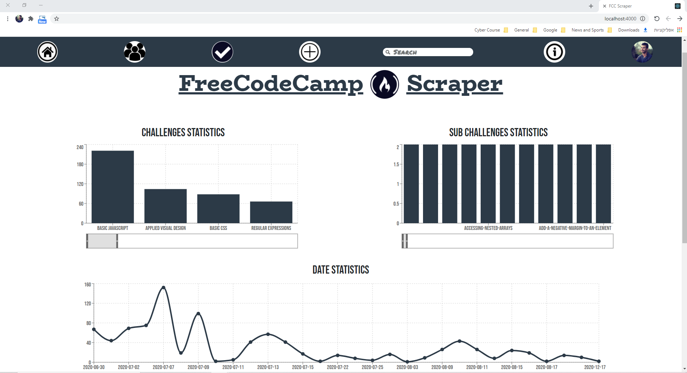
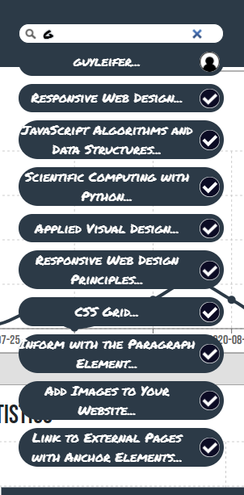
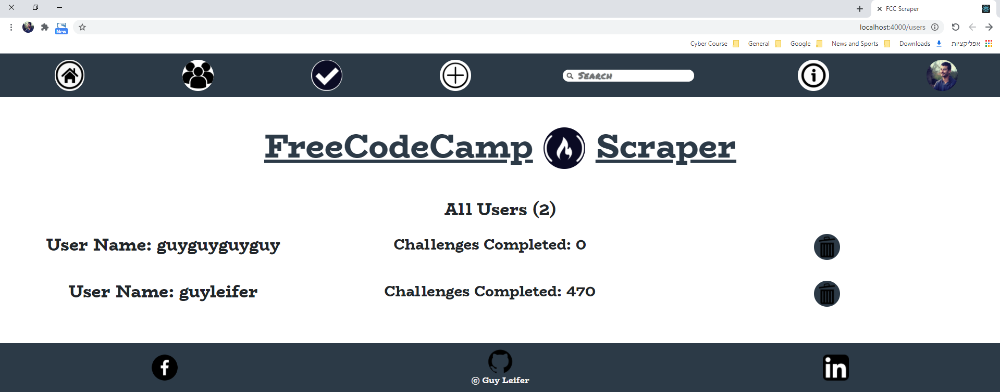
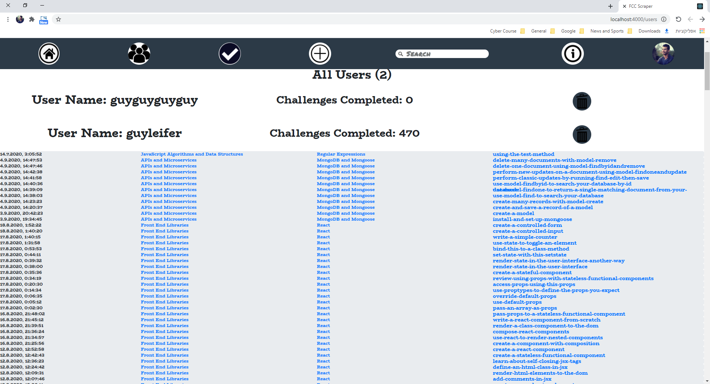
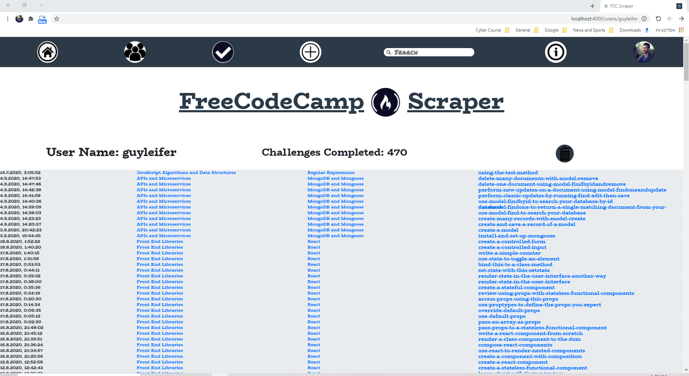
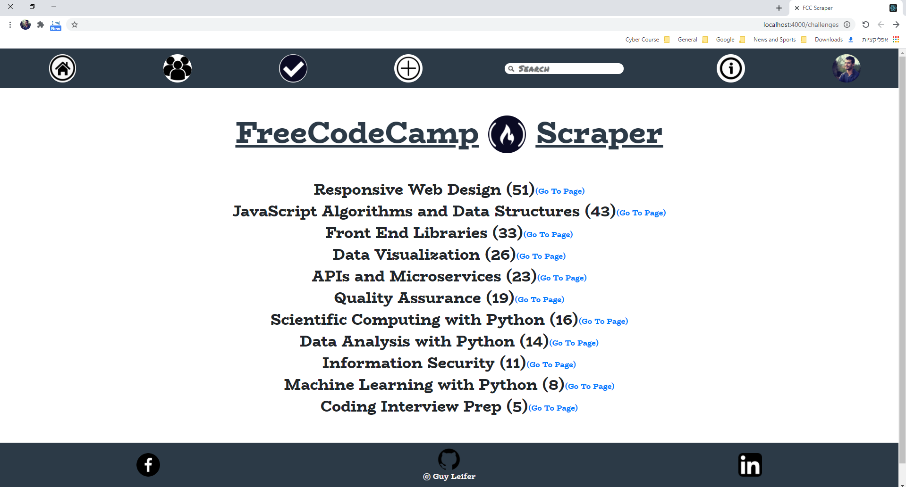
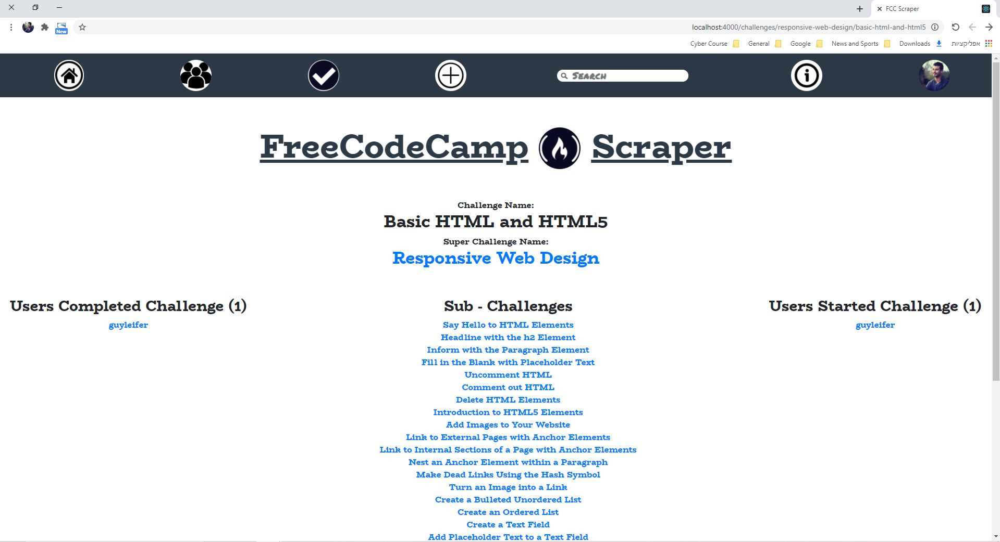
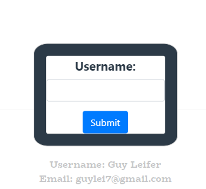
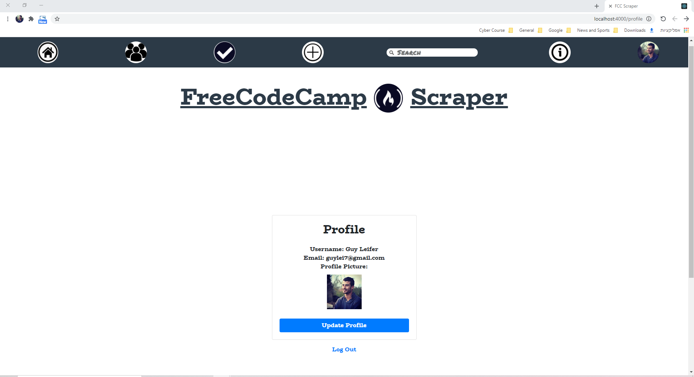
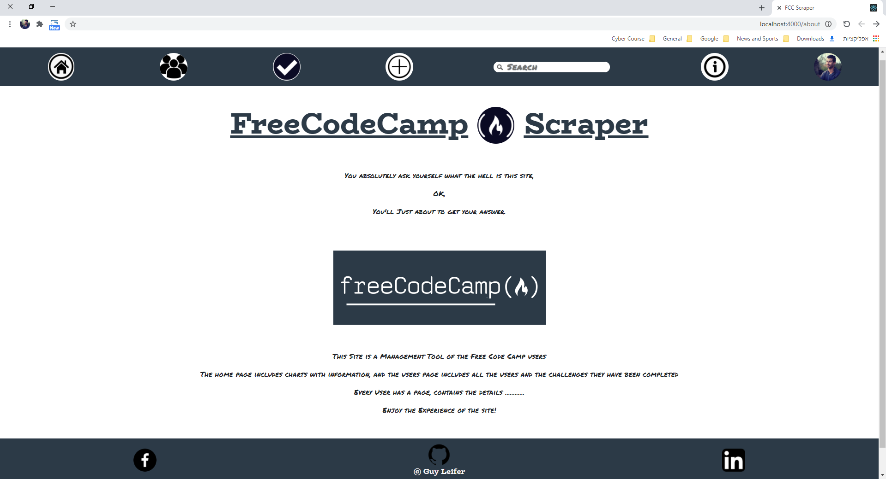

# FreeCodeCamp-Scraper
## Enjoy The FreeCodeCamp Scraper Service!
    this is a repository of a FreeCodeCamp Users and Challenges Scraper Service.
##
the repository has been made with React, and Node.js.
##
server side with queries and packages: "express", to make the service optimized for the best use.  
client side with usage of a lot of React packages, like: "recharts", "react-modal", "bootstrap", "react-bootstrap", "react-router-dom". for perfect use of the service.
client side also use "firebase" service for authentication, ("firebase" package).

## Instructions To Users
1. clone this repo to your device. 
2. open the folder in your editor.   
3. make sure your device has docker and docker-compose installed.
4. in the main folder run the command "docker-compose build".
5. in the main folder run the command "docker-compose up".

## Home Page
the home page contains a dashboard with four charts: 
### Challenges chart
    showing how much sub challenges in every challenge have been completed.
### Sub Challenges chart
    showing how much users completed the sub challenge.
### Date chart
    showing how much sub challenges have been completed by day.
### User chart
    showing how much challenges have been completed by user.

## Search Bar
    the service conatains a navigation bar for searching a specific user or challenge

## Users Page
    the users page contains a list of all the users in the service, including the challenges they've been completed.

## User Page
    the user page contains information about the user, and the challenges he has been completed.

## Challenges Page
    the challenges page contains the whole challenges in Free - Code - Camp and their sub challenges.

## Challenge Page
    the challenge page contains details about the Free - Code - Camp challenge and about users who have been completed or started it.

## Add User Page
    on click in the + icon in navbar a modal will open with option to add username

## Account Page
    the account page contains information about the user account.

## About
    the about page contains information about the service.

## ENJOY!